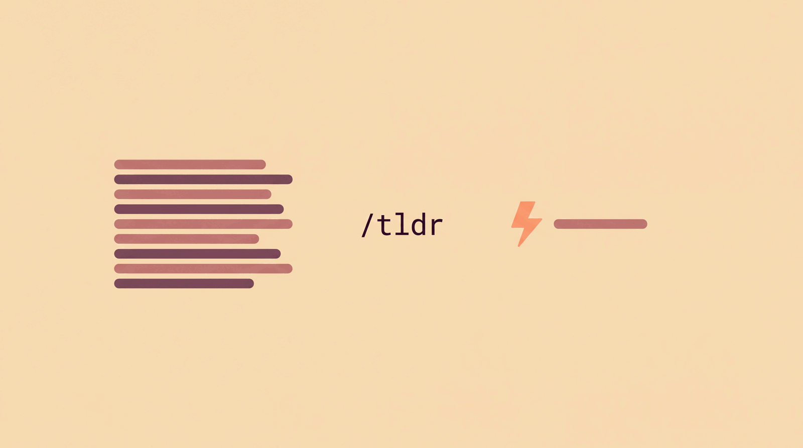

# tldr



**Version 1.2.2**

Short-reply mode for Claude Code. `/tldr` rewrites the last reply short and keeps every reply short until `/tldr off`. Replies start with `⚡`.

## Usage

```
/tldr                      max level
/tldr light|medium|max     level
/tldr --code diff          changed lines only
/tldr --scope chat         first run = TL;DR of whole chat
/tldr <question>           ask and turn the mode on
/tldr off                  normal replies
```

## Rules
- Answer first. No filler. Never repeat the subject.
- Only what was asked. Next-step details wait for the next question.
- Bottom line first. Once the consequence is known (do nothing / act), only facts that still matter survive.
- Code blocks exact. Prose around them one line.
- Questions via picker, after the short summary. Picker text is plain and complete, not compressed. Warnings kept, one line.
- "explain" (or תסביר) gets one normal reply, mode stays on.

## Files
- SKILL.md: the skill (loaded)
- settings.md: defaults, overridable per call
- assets/tldr-hero.png, assets/tldr-icon.png: hero image (16:9) and logomark (1:1)
- Spec and dev docs: `~/Projects/tldr-skill/`

## Changelog

### 1.2.2 — 2026-09-29
- An open question in the rewritten reply now gets the `⚡` summary first, then the picker. A live `/tldr` showed the picker alone, with no summary, and it read as if the skill had failed.
- Picker questions are no longer compressed. They say what changes and whose it is. The live picker said "restore the 52 capped at 3" right after "none of your scores were touched", which looked like a contradiction.
- `/tldr <question>` skips the rewrite of the previous reply.
- A level word that is part of the question (`/tldr max upload size here?`) is not read as a setting.
- Images shrunk for the repository: hero 1600 px wide, logomark 512 px, 256-colour PNG. Full-size originals are kept in `~/Projects/tldr-skill/assets-original/`.

### 1.2.1 — 2026-09-26
- Free text after `/tldr` is now the question to answer, not an unknown argument. Live use showed `/tldr <question>` is how the mode gets turned on mid-thought.
- Second live case under the verdict rule: a "yes" that restated the subject, added an analogy and the how-to. Now a one-line example in SKILL.md and PRD 7.12.

### 1.2.0 — 2026-09-25
- New rule: bottom line first, then only what survives it (PRD 7.12). A live "is it the update?" reply spent a paragraph on causes and the fix before saying "not worth it". Relevance after the verdict now decides what stays, not length alone.

### 1.1.1 — 2026-09-25
- Added hero image and logomark in `assets/`. Cream / peach / rose / plum palette, flat style. Slash + bolt is the mark.

### 1.1.0 — 2026-09-25
- Explain detector: "explain" / תסביר gets one normal reply, mode resumes. Reverses 1.0.0 "no escape hatch" after the first live test.
- PRD 0.2: rule 7.11, non-goals and lifecycle updated.

### 1.0.0 — 2026-09-25
- First release. Levels light / medium / max, six settings in settings.md.
- `⚡` prefix as the only indicator. Picker for questions to the user.
- No keyword escape hatch, by decision.
